<div align="center">
  <h1>🤖 Sef - AI Chatbot Platform</h1>
  <p><strong>On premise enterprise-grade RAG-powered agentic workflow chatbot platform with multi-provider support</strong></p>
  
  [](LICENSE.md)
  [](https://go.dev/)
  [](https://nextjs.org/)
  [](https://www.docker.com/)
  
  <p>
    <a href="README.md">English</a> •
    <a href="README_tr.md">Türkçe</a>
  </p>
</div>

---

## 📋 Table of Contents

- [Overview](#-overview)
- [Screenshots](#-screenshots)
- [Key Features](#-key-features)
- [Architecture](#-architecture)
- [Tech Stack](#-tech-stack)
- [Getting Started](#-getting-started)
- [Configuration](#-configuration)
- [Features in Detail](#-features-in-detail)
- [API Documentation](#-api-documentation)
- [Development](#-development)
- [Deployment](#-deployment)
- [Contributing](#-contributing)
- [License](#-license)

---

## 🎯 Overview

**Sef** is a modern, enterprise-ready AI chatbot platform that combines the power of Retrieval-Augmented Generation (RAG) with flexible multi-provider support and agentic tool usage system. Built with Go and Next.js, it offers a scalable solution for organizations looking to deploy intelligent conversational AI systems.

### Why Sef?

- **🤖 Agentic AI System**: Multi-turn tool usage with real-time streaming - automatically solves complex problems
- **🔐 Enterprise Authentication**: Built-in Keycloak integration for secure SSO
- **📚 Smart Document Processing**: Advanced RAG with hybrid search (semantic + keyword)
- **🔄 Multi-Provider Support**: Seamlessly switch between OpenAI, Ollama, and vLLM
- **🛠️ Tool Integration**: Web search, document analysis, and custom tool execution
- **🪟 Embeddable Widgets**: Ready-to-use chat widgets for external websites
- **🌍 Internationalization**: Full i18n support (English, Turkish)
- **📊 Analytics**: Comprehensive session tracking and analytics
- **🎨 Modern UI**: Beautiful, responsive interface built with shadcn/ui

---

## 📸 Screenshots

<div align="center">
  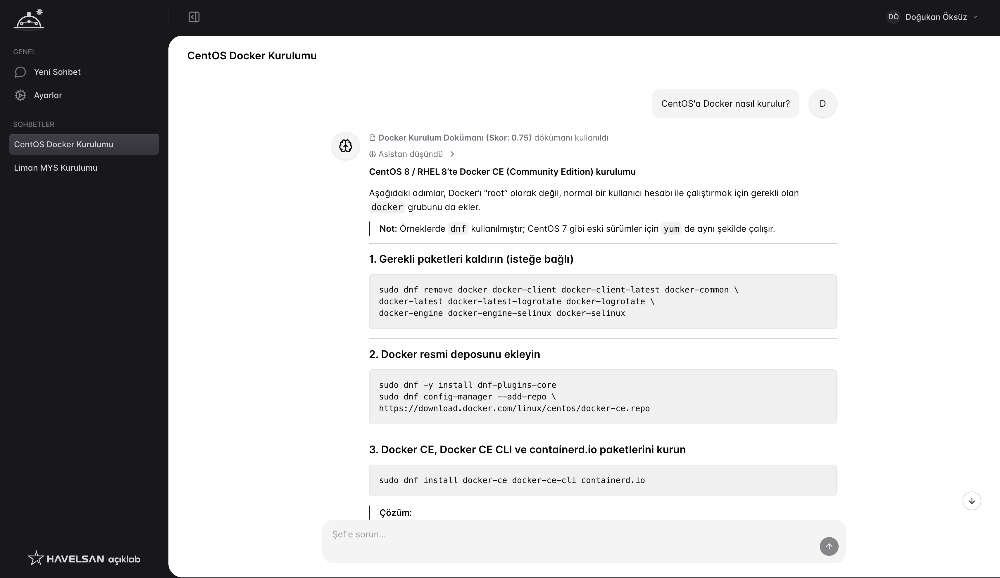
  <p><em>Chat Interface</em></p>
</div>

### Gallery

<div align="center">
  <table>
    <tr>
      <td width="33%">
        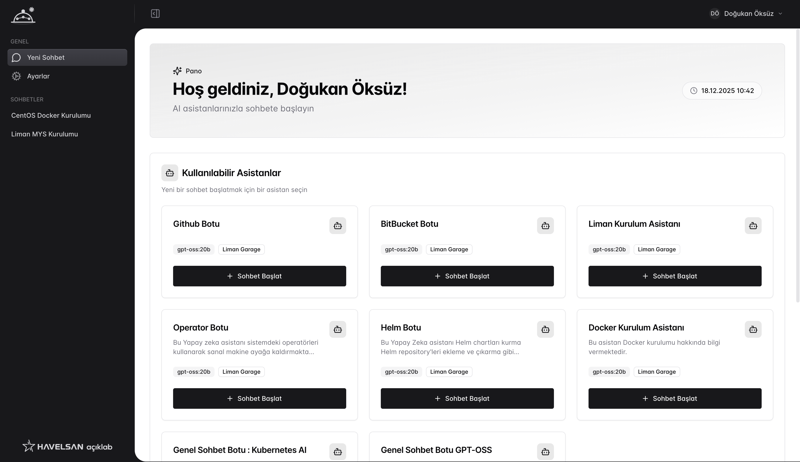
        <p align="center"><em>Home Page</em></p>
      </td>
      <td width="33%">
        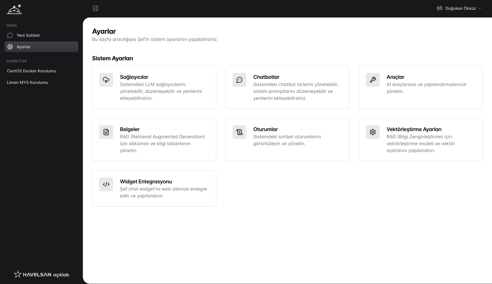
        <p align="center"><em>Settings Page</em></p>
      </td>
      <td width="33%">
        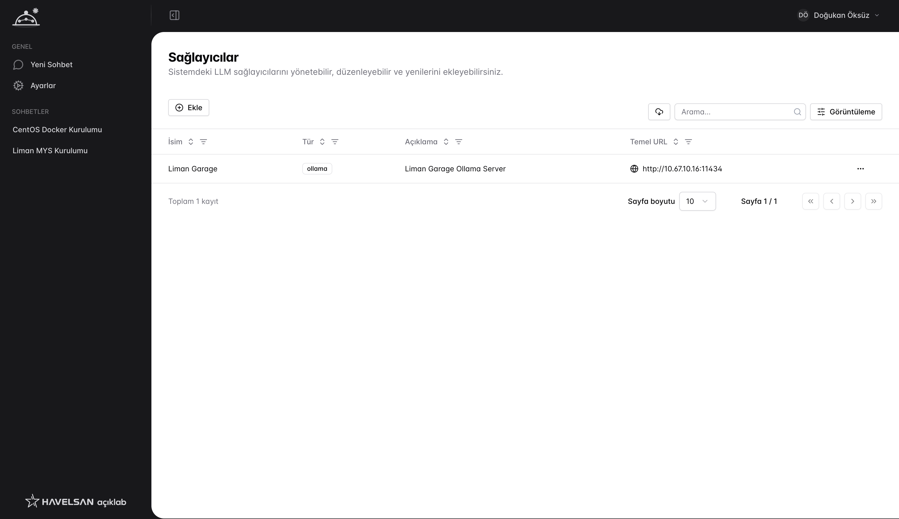
        <p align="center"><em>Provider Settings</em></p>
      </td>
    </tr>
    <tr>
      <td width="33%">
        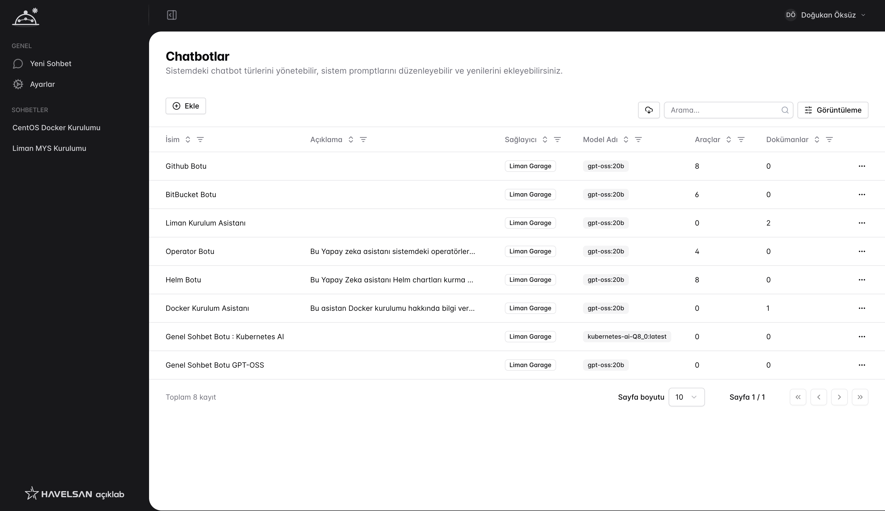
        <p align="center"><em>Chatbot Configuration</em></p>
      </td>
      <td width="33%">
        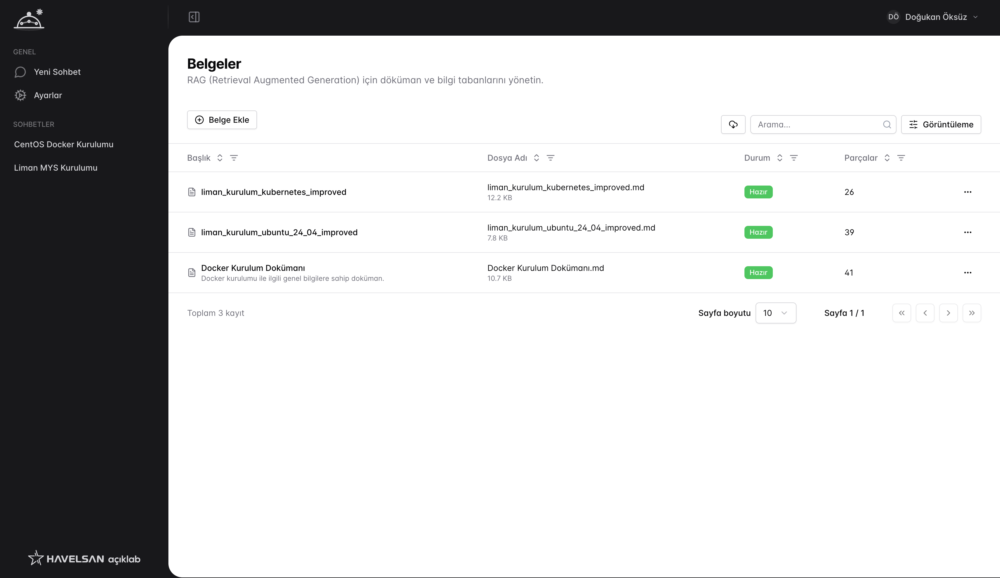
        <p align="center"><em>RAG Management</em></p>
      </td>
      <td width="33%">
        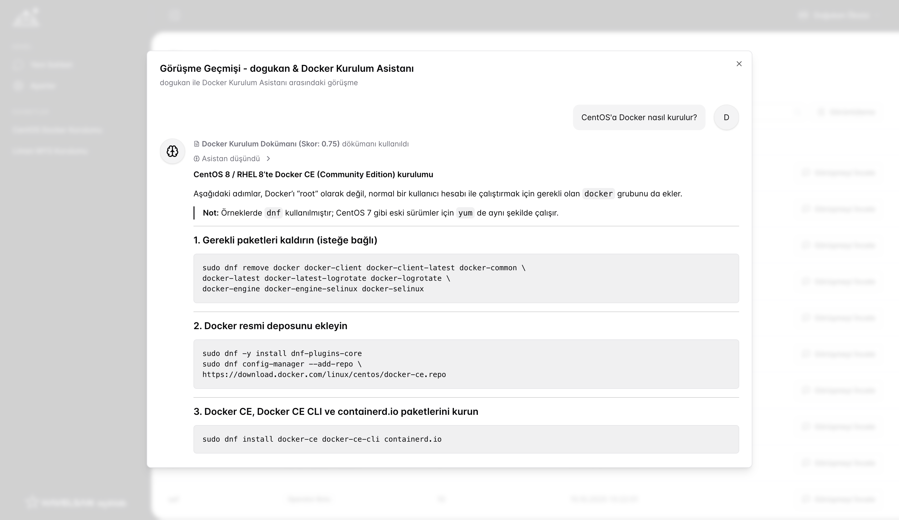
        <p align="center"><em>Session Logging</em></p>
      </td>
    </tr>
    <tr>
      <td width="33%">
        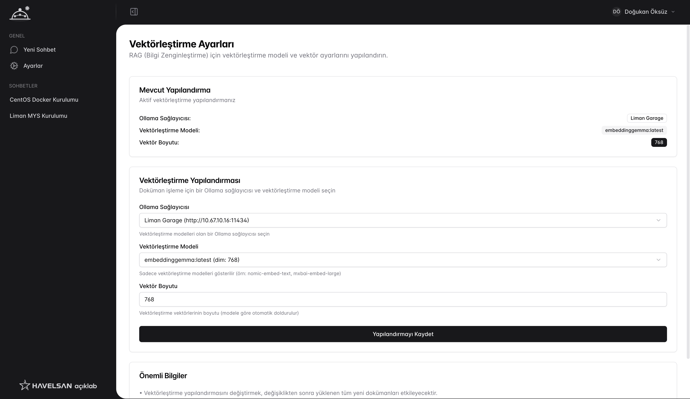
        <p align="center"><em>Embedding Settings</em></p>
      </td>
      <td width="33%">
        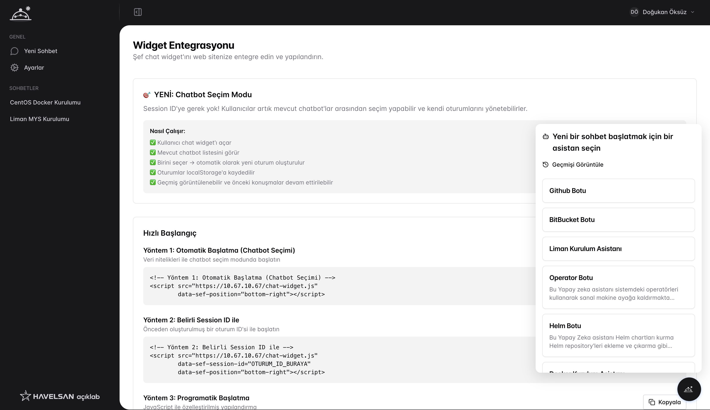
        <p align="center"><em>Widget System</em></p>
      </td>
      <td width="33%">
        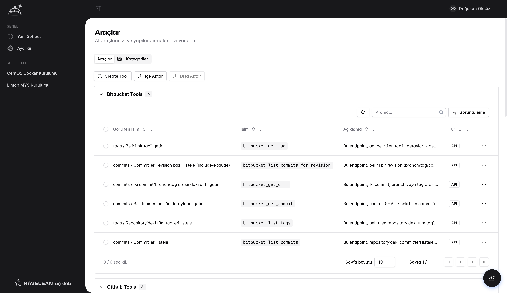
        <p align="center"><em>Tool Management</em></p>
      </td>
    </tr>
    <tr>
      <td width="33%">
        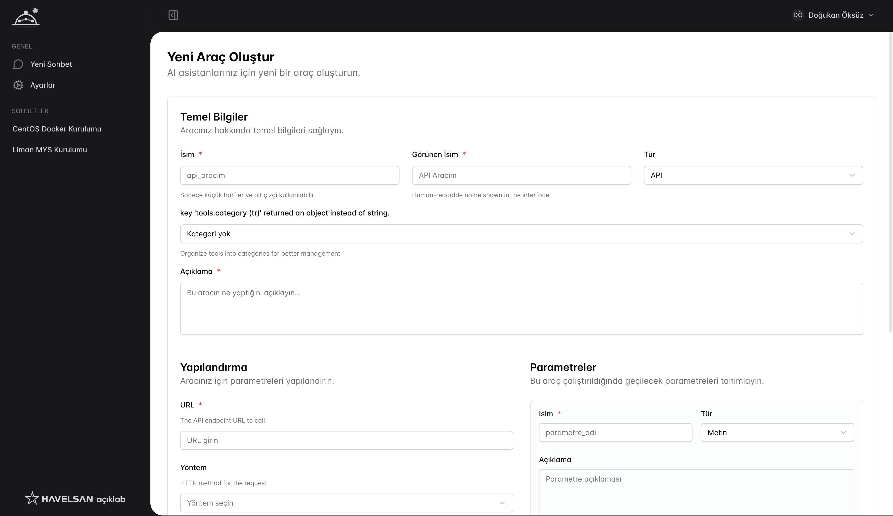
        <p align="center"><em>Create New Tool</em></p>
      </td>
      <td width="33%">
        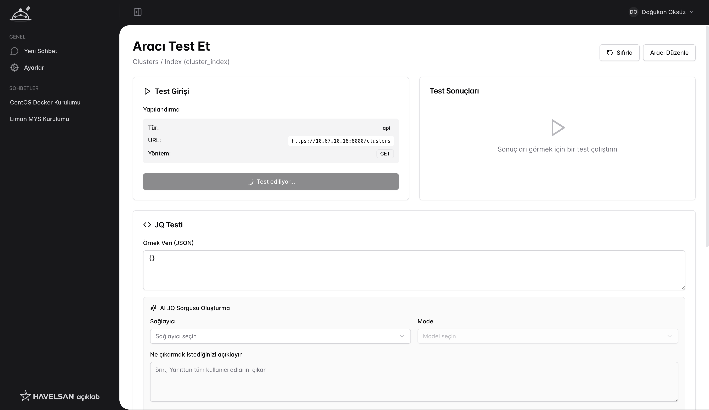
        <p align="center"><em>Test Tools</em></p>
      </td>
      <td width="33%">
      </td>
    </tr>
  </table>
</div>

---

## ✨ Key Features

### 🤖 Intelligent Conversations
- **Agentic Workflow**: Autonomous problem-solving with multi-turn tool execution until task completion
- **Real-time Streaming**: Live SSE-based streaming of responses and tool executions
- **RAG-Powered Responses**: Context-aware answers using your documents
- **Hybrid Search**: Combines semantic similarity and keyword matching
- **Smart Context Selection**: Dynamic chunk selection based on query complexity
- **Conversation Memory**: Maintains context across multi-turn conversations
- **Auto-Generated Summaries**: Automatic title generation for chat sessions based on conversation content

### 📄 Document Management
- **Advanced Chunking**: Intelligent document splitting with overlap
- **Vector Storage**: Qdrant integration for fast semantic search
- **Multiple Formats**: Support for TXT, MD, and other text formats
- **Embedding Generation**: Automatic vectorization of documents

### 🔧 Provider Management
- **OpenAI Compatible**: Native support for OpenAI API
- **Ollama Integration**: Run models locally with Ollama
- **vLLM Support**: Deploy with vLLM for high-performance inference
- **Per-Chatbot Configuration**: Each chatbot is assigned to a specific provider

### 🔍 Tool System
- **Agentic Tool Execution**: AI autonomously decides which tools to use and chains them together
- **Multi-Turn Problem Solving**: Continues using tools across multiple iterations until the goal is achieved
- **Real-time Tool Streaming**: See tool executions happening live with SSE updates
- **Web Search**: Integrated SearxNG for real-time web search
- **Custom Tools**: Extensible tool runner architecture
- **API Integration**: Call external APIs from conversations
- **Token Optimization**: TOON (Token Optimized Object Notation) support for efficient data transfer
- **JQ Query Selector**: Shrink JSON responses to extract only needed data
- **Tool Categories**: Organize tools for better management

### 🪟 Embeddable Widget System
- **External Integration**: Embed AI chatbots on any website with a simple script tag
- **Customizable UI**: Tailor widget appearance to match your brand
- **Lightweight**: Minimal performance impact on host websites
- **Cross-Domain Support**: Works seamlessly across different domains
- **Easy Setup**: Just add a single JavaScript snippet to your webpage

### 🔐 Security & Authentication
- **Keycloak Integration**: Enterprise SSO with role-based access control
- **JWT Tokens**: Secure session management
- **API Key Encryption**: AES encryption for sensitive credentials
- **Rate Limiting**: Built-in protection against abuse

---

## 🏗️ Architecture

```
┌─────────────────────────────────────────────────────────────┐
│                      Frontend (Next.js)                      │
│  - React 19 + TypeScript                                     │
│  - Tailwind CSS + shadcn/ui                                  │
│  - Real-time updates via SSE                                 │
└─────────────────────┬───────────────────────────────────────┘
                      │ REST API + SSE
┌─────────────────────▼───────────────────────────────────────┐
│                    Backend (Go + Fiber)                      │
│  ┌──────────────┐  ┌──────────────┐  ┌──────────────┐      │
│  │ Auth Layer   │  │ RAG Service  │  │ Tool Runners │      │
│  │ (Keycloak)   │  │              │  │  (TOON/JQ)   │      │
│  └──────────────┘  └──────────────┘  └──────────────┘      │
│  ┌──────────────────────────────────────────────────┐      │
│  │         AI Provider Manager                       │      │
│  │  (OpenAI / Ollama / vLLM)                        │      │
│  └──────────────────────────────────────────────────┘      │
└─────────────┬───────────────────┬─────────────┬────────────┘
              │                   │             │
    ┌─────────▼──────┐  ┌────────▼────────┐  ┌─▼──────────┐
    │  PostgreSQL    │  │    Qdrant       │  │  SearxNG   │
    │  (Main DB)     │  │  (Vector DB)    │  │  (Search)  │
    └────────────────┘  └─────────────────┘  └────────────┘
              │
    ┌─────────▼──────┐
    │     Redis      │
    │   (Cache)      │
    └────────────────┘
```

---

## 🛠️ Tech Stack

### Backend
- **[Go](https://go.dev/)** (1.25+) - High-performance backend
- **[Fiber v3](https://gofiber.io/)** - Fast HTTP framework
- **[GORM](https://gorm.io/)** - Database ORM
- **[Qdrant](https://qdrant.tech/)** - Vector database for embeddings
- **[Redis](https://redis.io/)** - Caching and session storage
- **[Keycloak](https://www.keycloak.org/)** - Identity and access management

### Frontend
- **[Next.js 16](https://nextjs.org/)** - React framework with Turbopack
- **[React 19](https://react.dev/)** - UI library
- **[TypeScript](https://www.typescriptlang.org/)** - Type safety
- **[Tailwind CSS](https://tailwindcss.com/)** - Utility-first styling
- **[shadcn/ui](https://ui.shadcn.com/)** - Beautiful component library
- **[Radix UI](https://www.radix-ui.com/)** - Accessible primitives

### AI & ML
- **[OpenAI API](https://openai.com/)** - GPT models
- **[Ollama](https://ollama.ai/)** - Local model deployment
- **[vLLM](https://github.com/vllm-project/vllm)** - High-throughput inference
- **SearxNG** - Privacy-respecting metasearch

---

## 🚀 Getting Started

### Prerequisites

- **Docker** & **Docker Compose**
- **Git**
- (Optional) **Go 1.25+** for local development
- (Optional) **Node.js 18+** for frontend development

### Quick Start with Docker

1. **Clone the repository**
   ```bash
   git clone https://github.com/yourusername/sef.git
   cd sef
   ```

2. **Start all services**
   ```bash
   # Edit needed values before starting
   docker-compose up -d
   ```

3. **Access the application**
   - Frontend: http://localhost:3000
   - Backend API: http://localhost:8110
   - Keycloak: http://localhost:8080
   - Qdrant Dashboard: http://localhost:6333/dashboard

4. **Set up Keycloak** (First time only)
   
   Follow the detailed guide in [docs/KEYCLOAK_SETUP.md](docs/KEYCLOAK_SETUP.md)

### Services Overview

| Service    | Port | Description                      |
|------------|------|----------------------------------|
| Frontend   | 3000 | Next.js web application         |
| Backend    | 8110 | Go API server                   |
| PostgreSQL | 5432 | Main database                   |
| Redis      | 6379 | Cache & session storage         |
| Qdrant     | 6333 | Vector database                 |
| SearxNG    | 8888 | Search engine                   |
| Keycloak   | 8080 | Authentication server           |

---

## ⚙️ Configuration

### Environment Variables

#### Backend Configuration

```env
# Application
APP_ENV=production
APP_KEY=your-secret-key-here
APP_DEBUG=false

# Database
DATABASE_HOST=postgresql
DATABASE_PORT=5432
DATABASE_NAME=sef
DATABASE_USER=sef_user
DATABASE_PASSWORD=sef_password

# Redis
REDIS_HOST=redis
REDIS_PORT=6379

# Qdrant
QDRANT_HOST=qdrant
QDRANT_PORT=6333

# Keycloak
KEYCLOAK_URL=http://keycloak:8080
KEYCLOAK_REALM=sef-realm
KEYCLOAK_CLIENT_ID=sef-client
KEYCLOAK_CLIENT_SECRET=your-client-secret

# AI Providers (Optional)
OLLAMA_HOST=localhost
OLLAMA_PORT=11434
```

#### Frontend Configuration

```env
NODE_ENV=production
NEXT_PUBLIC_API_URL=http://localhost:8110
```

### Adding AI Providers

1. Navigate to **Settings** → **Providers**
2. Click **Add Provider**
3. Configure:
   - **Type**: OpenAI, Ollama, or vLLM
   - **API Key**: Your provider's API key
   - **Base URL**: Provider endpoint
   - **Models**: Available models

For vLLM setup, see [docs/vLLM_SUPPORT.md](docs/vLLM_SUPPORT.md)

---

## 🎨 Features in Detail

### RAG (Retrieval-Augmented Generation)

The RAG system enhances AI responses with your documents:

1. **Document Upload**: Upload text files or markdown documents
2. **Intelligent Chunking**: Documents are split into optimal chunks
3. **Embedding Generation**: Text is converted to vector embeddings
4. **Hybrid Search**: Queries use both semantic and keyword search
5. **Context Injection**: Relevant chunks are added to prompts
6. **Smart Responses**: AI generates answers using your data

#### Advanced Features
- **Query Analysis**: Detects small talk vs. knowledge queries
- **Dynamic Limits**: Adjusts chunk count based on complexity
- **Reranking**: Filters and sorts results by relevance
- **Deduplication**: Removes duplicate information

### Chatbot Customization

Create specialized chatbots with:
- Custom system prompts
- Specific document collections
- Assigned tools and capabilities
- Dedicated provider assignment
- Temperature and parameter tuning

### Tool System

Built-in tools include:
- **Web Search**: Real-time internet search via SearxNG
- **Document Query**: Search your knowledge base
- **API Calls**: Execute HTTP requests with token optimization
- **Custom Tools**: Add your own via the tool runner interface

#### Token Optimization Features
- **TOON (Token Optimized Object Notation)**: Compact data representation that significantly reduces token usage
- **JQ Query Selector**: Extract specific fields from JSON responses to minimize data size
- **Smart Data Filtering**: Only fetch and process the data your chatbot actually needs
- **Reduced Costs**: Lower token consumption means reduced API costs

---

## 📚 API Documentation

### Authentication

All API requests require authentication via Bearer token:

```bash
Authorization: Bearer <your-token>
```

### Key Endpoints

#### Sessions
```http
GET    /api/sessions                    # List all sessions
POST   /api/sessions                    # Create new session
GET    /api/sessions/:id                # Get session details
DELETE /api/sessions/:id                # Delete session
```

#### Messages
```http
GET    /api/sessions/:id/messages       # Get messages
POST   /api/sessions/:id/messages       # Send message
```

#### Documents
```http
GET    /api/documents                   # List documents
POST   /api/documents                   # Upload document
DELETE /api/documents/:id               # Delete document
```

#### Chatbots
```http
GET    /api/chatbots                    # List chatbots
POST   /api/chatbots                    # Create chatbot
PUT    /api/chatbots/:id                # Update chatbot
DELETE /api/chatbots/:id                # Delete chatbot
```

For complete API documentation, see the [API Reference](docs/API.md).

---

## 💻 Development

### Local Development Setup

#### Backend

```bash
cd backend

# Install dependencies
go mod tidy

# Start development server
go run cmd/server/main.go
```

#### Frontend

```bash
cd frontend

# Install dependencies
pnpm install

# Start development server
pnpm dev
```

You might want to edit next configuration for local development.

### Project Structure

```
sef/
├── backend/
│   ├── app/
│   │   ├── controllers/      # HTTP handlers
│   │   ├── entities/         # Database models
│   │   ├── middleware/       # Request middleware
│   │   └── routes/           # Route definitions
│   ├── internal/             # Internal packages
│   ├── pkg/                  # Reusable packages
│   │   ├── rag/              # RAG implementation
│   │   ├── providers/        # AI provider clients
│   │   ├── toolrunners/      # Tool execution
│   │   └── ...
│   └── cmd/server/           # Entry point
│
├── frontend/
│   ├── src/
│   │   ├── components/       # React components
│   │   ├── hooks/            # Custom hooks
│   │   ├── lib/              # Utilities
│   │   ├── pages/            # Next.js pages
│   │   ├── services/         # API services
│   │   └── types/            # TypeScript types
│   └── public/               # Static assets
│
├── docs/                     # Documentation
└── docker-compose.yml        # Docker setup
```

### Code Style

- **Backend**: Follow standard Go conventions (`gofmt`, `golint`)
- **Frontend**: ESLint + Prettier configured
- **Commits**: Use conventional commits format

---

## 🚢 Deployment

### Docker Production

```bash
# Build and start all services
docker-compose up -d --build

# View logs
docker-compose logs -f

# Stop services
docker-compose down
```

### Nginx Setup

For HTTPS deployment:

```bash
chmod +x scripts/setup-nginx-https.sh
./scripts/setup-nginx-https.sh
```

---

## 🤝 Contributing

We welcome contributions! Please follow these steps:

1. **Fork the repository**
2. **Create a feature branch**
   ```bash
   git checkout -b feature/amazing-feature
   ```
3. **Make your changes**
4. **Commit your changes**
   ```bash
   git commit -m 'feat: add amazing feature'
   ```
5. **Push to your fork**
   ```bash
   git push origin feature/amazing-feature
   ```
6. **Open a Pull Request**

### Development Guidelines

- Write clean, documented code
- Add tests for new features
- Update documentation as needed
- Follow the existing code style
- Keep commits atomic and well-described

---

## 📄 License

This project is licensed under the MIT License - see the [LICENSE.md](LICENSE.md) file for details.

---

## 🙏 Acknowledgments

Built with amazing open-source technologies:
- [Go](https://go.dev/)
- [Next.js](https://nextjs.org/)
- [Qdrant](https://qdrant.tech/)
- [Keycloak](https://www.keycloak.org/)
- [SearxNG](https://docs.searxng.org/)
- [shadcn/ui](https://ui.shadcn.com/)

---

## 📞 Support

- **Documentation**: [docs/](docs/)
- **Issues**: [GitHub Issues](https://github.com/limanmys/sef/issues)
- **Discussions**: [GitHub Discussions](https://github.com/limanmys/sef/discussions)

---

<div align="center">
  <p>Made with ❤️ by the HAVELSAN Açıklab</p>
  <p>⭐ Star us on GitHub if you find this project useful!</p>
</div>